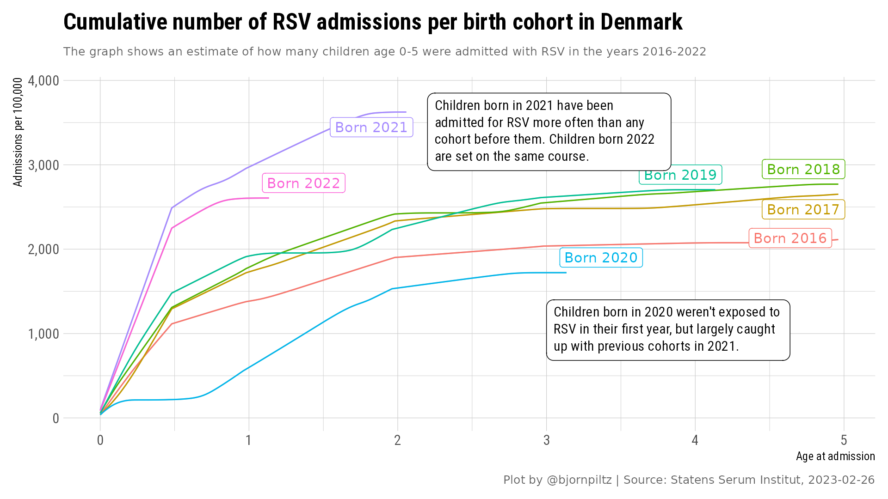
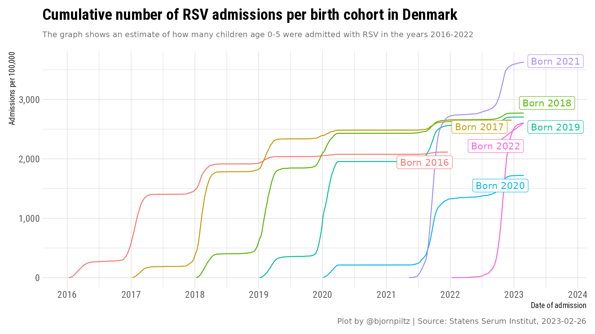
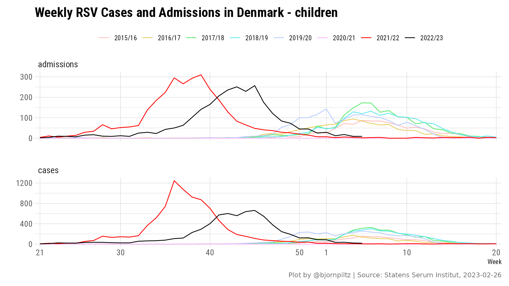
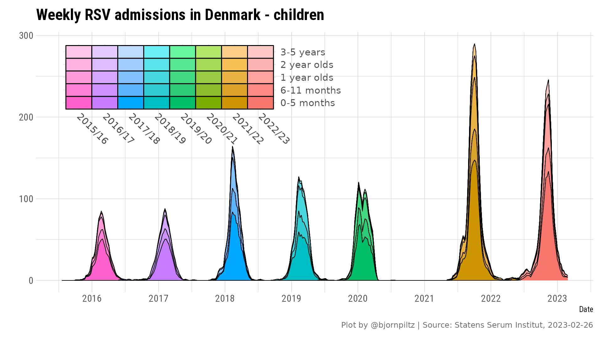
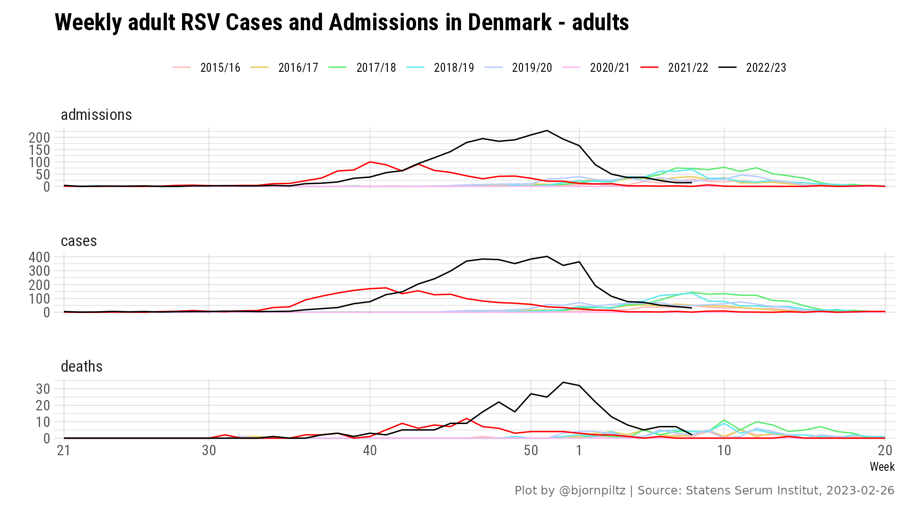
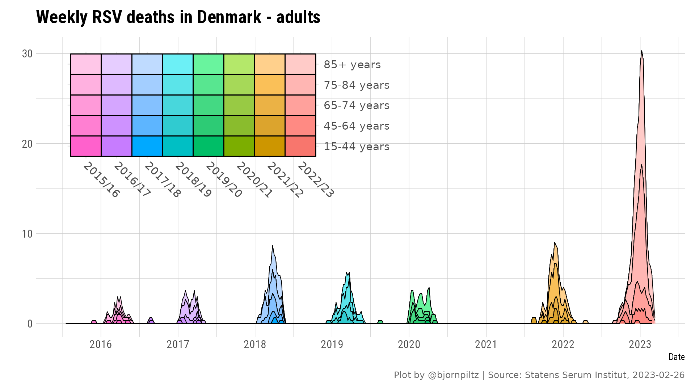

# RSV Infections in Denmark
This repo contains the data for RSV infections, admissions and deaths 2015-2022 and visualizations to highlight the unusual 2021/2022 and 2022/2023 seasons.
* The data as downloaded from <a href="https://experience.arcgis.com/experience/220fef27d07d438889d651cc2e00076c/page/RS-virus/">Danish Statens Serum Institut</a> can be found <a href="data/rsv_denmark.csv?raw=true">here in CSV format</a>
* The notebooks in this repositories contain the code necessary to reproduce the plots on this page and several others

## RSV Infections and admissions in children

## RSV in children - a cohort analysis

## RSV Infections and admissions in adults

